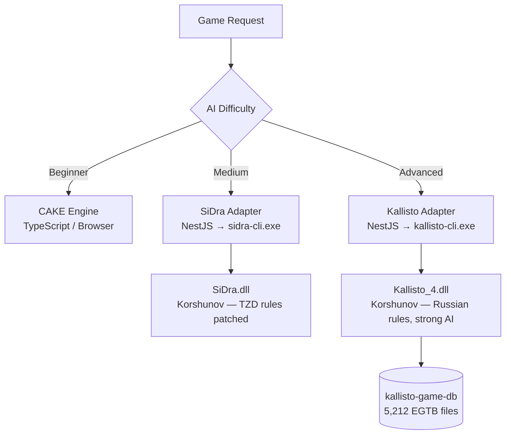

# Kallisto Engine Integration — Walkthrough

## What Was Done

Integrated **Kallisto_4.dll** as a strong AI engine alongside SiDra, with both exposed as injectable NestJS adapters. CAKE remains as the browser-side move validator.

---

## Engine Architecture



---

## Files Created

| File | Role |
|------|------|
| [engines/kallisto/kallisto-cli.cpp](file:///c:/Users/Admin/Desktop/TzDraft/engines/kallisto/kallisto-cli.cpp) | C++ shim — loads Kallisto_4.dll via LoadLibrary, JSON stdin→stdout |
| [engines/kallisto/build_kallisto_cli.bat](file:///c:/Users/Admin/Desktop/TzDraft/engines/kallisto/build_kallisto_cli.bat) | Build script with auto MSVC x86 detection |
| [engines/kallisto/Kallisto_4.dll](file:///c:/Users/Admin/Desktop/TzDraft/engines/kallisto/Kallisto_4.dll) | 32-bit DLL copied from docs/kallisto |
| [engines/kallisto/kallisto-cli.exe](file:///c:/Users/Admin/Desktop/TzDraft/engines/kallisto/kallisto-cli.exe) | Compiled CLI shim (x86) |
| [backend/src/infrastructure/engine/engine-adapter.interface.ts](file:///c:/Users/Admin/Desktop/TzDraft/backend/src/infrastructure/engine/engine-adapter.interface.ts) | Shared [IEngineAdapter](file:///c:/Users/Admin/Desktop/TzDraft/backend/src/infrastructure/engine/engine-adapter.interface.ts#23-40) contract |
| [backend/src/infrastructure/engine/kallisto.adapter.ts](file:///c:/Users/Admin/Desktop/TzDraft/backend/src/infrastructure/engine/kallisto.adapter.ts) | NestJS [KallistoAdapter](file:///c:/Users/Admin/Desktop/TzDraft/backend/src/infrastructure/engine/kallisto.adapter.ts#22-138) service |
| [backend/src/infrastructure/engine/sidra.adapter.ts](file:///c:/Users/Admin/Desktop/TzDraft/backend/src/infrastructure/engine/sidra.adapter.ts) | NestJS [SidraAdapter](file:///c:/Users/Admin/Desktop/TzDraft/backend/src/infrastructure/engine/sidra.adapter.ts#21-114) service |
| [backend/src/infrastructure/engine/engine.module.ts](file:///c:/Users/Admin/Desktop/TzDraft/backend/src/infrastructure/engine/engine.module.ts) | `@Global` NestJS module exporting both adapters |

---

## Key Discovery — 32-bit DLL

During integration, `LoadLibrary` was failing silently. Diagnosis via `dumpbin /headers` revealed:

```
14C machine (x86)   ← 32-bit DLL
32 bit word machine
```

**Fix:** Rebuilt `kallisto-cli.exe` targeting `x86` using `vcvarsall.bat x86`. The DLL has zero third-party dependencies (only `KERNEL32.dll` + `USER32.dll`).

---

## Smoke Test Result ✅

Input — starting position (24 pieces), WHITE to move, 2 second time limit:

```json
{"currentPlayer":"WHITE","timeLimitMs":2000,"pieces":[...24 starting pieces...]}
```

Kallisto output:
```json
{"from":22,"to":17,"capturedSquares":[],"isPromotion":false}
```

Kallisto also streamed its internal search info to stderr (not visible to Node):
```
depth: 15  score: -3  time: 0.063  speed: 2662  best: c3b4
```

This confirms Kallisto is thinking to **depth 15** and returning a real opening move (`c3-b4` in algebraic = position 22→17 in numeric).

---

## Backend Build ✅

```
pnpm run build  →  Exit code: 0
```

All TypeScript in `backend/src/infrastructure/engine/` compiles cleanly.

---

## Next Steps (Future)

1. **Wire AI difficulty routing** in `GameGateway` — when player requests AI move at level `KALLISTO`, call `KallistoAdapter.getBestMove()`
2. **Add EGTB config** — set `KALLISTO_CLI_PATH` and point the CLI to `docs/kallisto/kallisto-game-db`
3. **Build your own TZD-native engine** — measure its strength against Kallisto to track progress

### Environment Variables
Add to `backend/.env`:
```env
KALLISTO_CLI_PATH=../engines/kallisto/kallisto-cli.exe
KALLISTO_TIME_LIMIT_MS=3000
SIDRA_CLI_PATH=../engines/sidra/cli/sidra-cli.exe
SIDRA_TIME_LIMIT_MS=3000
```
