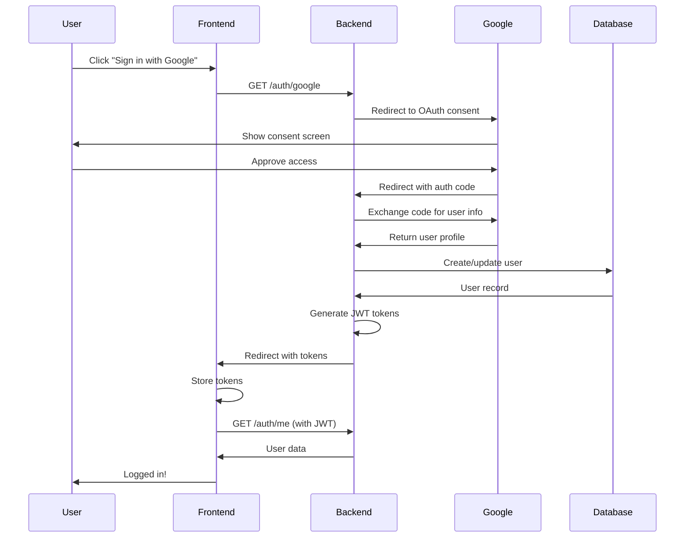

# OAuth2 with JWT Authentication Implementation Guide

A comprehensive guide to implementing Google OAuth2 authentication with JWT tokens in a NestJS backend and Next.js frontend.

---

## Table of Contents

1. [Architecture Overview](#architecture-overview)
2. [Backend Implementation (NestJS)](#backend-implementation-nestjs)
3. [Frontend Implementation (Next.js)](#frontend-implementation-nextjs)
4. [Database Schema](#database-schema)
5. [Security Considerations](#security-considerations)
6. [Testing & Troubleshooting](#testing--troubleshooting)

---

## Architecture Overview

### Authentication Flow



### Key Components

- **OAuth2 Provider**: Google (handles user authentication)
- **JWT Tokens**: Used for session management after OAuth
- **Access Token**: Short-lived (15 min), used for API requests
- **Refresh Token**: Long-lived (7 days), used to get new access tokens

---

## Backend Implementation (NestJS)

### 1. Install Dependencies

```bash
npm install @nestjs/passport passport passport-google-oauth20
npm install --save-dev @types/passport-google-oauth20
```

### 2. Environment Variables

Create `.env` file with OAuth credentials:

```env
# Google OAuth
GOOGLE_CLIENT_ID="your-client-id.apps.googleusercontent.com"
GOOGLE_CLIENT_SECRET="your-client-secret"

# JWT Secrets
JWT_SECRET="your-jwt-secret-key"
JWT_REFRESH_SECRET="your-refresh-secret-key"

# Server Configuration
PORT=3002
FRONTEND_URL="http://localhost:3000"
```

### 3. Database Schema (Prisma)

Update your User model to support OAuth:

```prisma
model User {
  id           String    @id @default(uuid())
  phoneNumber  String    @unique @map("phone_number")
  email        String?   @unique
  username     String    @unique
  name         String?   // Real name from OAuth provider
  displayName  String    @unique @map("display_name")
  passwordHash String?   @map("password_hash") // Optional for OAuth users
  isVerified   Boolean   @default(false) @map("is_verified")

  // OAuth fields
  googleId      String? @unique @map("google_id")
  oauthProvider String? @map("oauth_provider") // 'google', 'facebook', etc.

  createdAt    DateTime  @default(now()) @map("created_at")
  lastLoginAt  DateTime? @map("last_login_at")

  rating              Rating?
  refreshTokens       RefreshToken[]
  // ... other relations

  @@map("users")
}
```

Run migration:

```bash
npx prisma migrate dev --name add_oauth_fields
```

### 4. Google OAuth Strategy

Create `src/auth/strategies/google.strategy.ts`:

```typescript
import { Injectable } from "@nestjs/common";
import { PassportStrategy } from "@nestjs/passport";
import { Strategy, VerifyCallback } from "passport-google-oauth20";
import { ConfigService } from "@nestjs/config";
import { AuthService } from "../auth.service";

@Injectable()
export class GoogleStrategy extends PassportStrategy(Strategy, "google") {
  constructor(
    private configService: ConfigService,
    private authService: AuthService,
  ) {
    const clientID = configService.get<string>("GOOGLE_CLIENT_ID");
    const clientSecret = configService.get<string>("GOOGLE_CLIENT_SECRET");
    const port = configService.get<string>("PORT") || "3002";
    const callbackURL = `http://localhost:${port}/auth/google/callback`;

    super({
      clientID,
      clientSecret,
      callbackURL,
      scope: ["email", "profile"],
    });
  }

  async validate(
    accessToken: string,
    refreshToken: string,
    profile: any,
    done: VerifyCallback,
  ): Promise<any> {
    const { id, name, emails } = profile;

    const user = await this.authService.validateOAuthUser({
      googleId: id,
      email: emails[0].value,
      name: `${name.givenName} ${name.familyName}`,
      oauthProvider: "google",
    });

    done(null, user);
  }
}
```

### 5. Auth Service - OAuth User Validation

Add to `src/auth/auth.service.ts`:

```typescript
async validateOAuthUser(profile: {
  googleId: string;
  email: string;
  name: string;
  oauthProvider: string;
}): Promise<any> {
  // Check if user exists by email
  let user = await this.prisma.user.findUnique({
    where: { email: profile.email },
    include: { rating: true },
  });

  if (user) {
    // User exists, link Google account if not already linked
    if (!user.googleId) {
      user = await this.prisma.user.update({
        where: { id: user.id },
        data: {
          googleId: profile.googleId,
          oauthProvider: profile.oauthProvider,
          name: profile.name,
        },
        include: { rating: true },
      });
    }
    return user;
  }

  // User doesn't exist, create new user
  const username = await this.generateUniqueUsername(profile.email);
  const displayName = await this.generateUniqueDisplayName(profile.name);

  user = await this.prisma.user.create({
    data: {
      email: profile.email,
      username,
      name: profile.name,
      displayName,
      googleId: profile.googleId,
      oauthProvider: profile.oauthProvider,
      phoneNumber: `oauth_${profile.googleId}`, // Placeholder
      isVerified: true, // OAuth users are auto-verified
      passwordHash: null, // No password for OAuth users
      rating: {
        create: {
          rating: 500, // Default rating
        },
      },
    },
    include: { rating: true },
  });

  return user;
}

// Generate unique username from email
private async generateUniqueUsername(email: string): Promise<string> {
  const baseUsername = email
    .split('@')[0]
    .toLowerCase()
    .replace(/[^a-z0-9_]/g, '_');

  let username = baseUsername;
  let attempts = 0;

  while (attempts < 10) {
    const exists = await this.prisma.user.findUnique({
      where: { username },
    });

    if (!exists) return username;

    // Add random suffix if collision
    const suffix = crypto.randomBytes(2).toString('hex');
    username = `${baseUsername}_${suffix}`;
    attempts++;
  }

  throw new Error('Could not generate unique username');
}

// Generate unique display name
private async generateUniqueDisplayName(name: string): Promise<string> {
  const baseName = name.replace(/\s+/g, '');
  let displayName = baseName;
  let attempts = 0;

  while (attempts < 10) {
    const exists = await this.prisma.user.findUnique({
      where: { displayName },
    });

    if (!exists) return displayName;

    // Add numeric suffix if collision
    attempts++;
    displayName = `${baseName}${attempts + 1}`;
  }

  throw new Error('Could not generate unique display name');
}

// Make this method public for OAuth callback
public async generateTokens(userId: string) {
  const payload = { sub: userId };

  const [accessToken, refreshToken] = await Promise.all([
    this.jwtService.signAsync(payload, {
      secret: this.configService.get('JWT_SECRET'),
      expiresIn: '15m',
    }),
    this.jwtService.signAsync(payload, {
      secret: this.configService.get('JWT_REFRESH_SECRET'),
      expiresIn: '7d',
    }),
  ]);

  // Store refresh token in database
  await this.prisma.refreshToken.create({
    data: {
      token: refreshToken,
      userId,
      expiresAt: new Date(Date.now() + 7 * 24 * 60 * 60 * 1000),
    },
  });

  return { accessToken, refreshToken };
}
```

### 6. Auth Controller - OAuth Endpoints

Add to `src/auth/auth.controller.ts`:

```typescript
import { Controller, Get, UseGuards, Res } from "@nestjs/common";
import { AuthGuard } from "@nestjs/passport";
import type { Response } from "express";
import { Public } from "./decorators/public.decorator";
import { CurrentUser } from "./decorators/current-user.decorator";

@Controller("auth")
export class AuthController {
  constructor(private authService: AuthService) {}

  // Initiate Google OAuth flow
  @Public()
  @Get("google")
  @UseGuards(AuthGuard("google"))
  async googleAuth() {
    // Redirects to Google
  }

  // Handle Google OAuth callback
  @Public()
  @Get("google/callback")
  @UseGuards(AuthGuard("google"))
  async googleAuthCallback(@CurrentUser() user: any, @Res() res: Response) {
    // Generate JWT tokens
    const { accessToken, refreshToken } = await this.authService.generateTokens(
      user.id,
    );

    // Redirect to frontend with tokens
    const frontendUrl = process.env.FRONTEND_URL || "http://localhost:3000";
    const redirectUrl = `${frontendUrl}/auth/oauth-callback?accessToken=${accessToken}&refreshToken=${refreshToken}`;

    return res.redirect(redirectUrl);
  }
}
```

### 7. Register Google Strategy

Update `src/auth/auth.module.ts`:

```typescript
import { Module } from "@nestjs/common";
import { GoogleStrategy } from "./strategies/google.strategy";

@Module({
  imports: [
    // ... other imports
  ],
  controllers: [AuthController],
  providers: [
    AuthService,
    GoogleStrategy, // Add this
    // ... other providers
  ],
})
export class AuthModule {}
```

---

## Frontend Implementation (Next.js)

### 1. Google Sign-In Button Component

Create `src/components/auth/GoogleSignInButton.tsx`:

```typescript
"use client";

import { FcGoogle } from "react-icons/fc";

interface GoogleSignInButtonProps {
    text?: string;
}

export default function GoogleSignInButton({
    text = "Continue with Google"
}: GoogleSignInButtonProps) {
    const handleGoogleSignIn = () => {
        // Redirect to backend OAuth endpoint
        const backendUrl = process.env.NEXT_PUBLIC_API_URL || 'http://localhost:3002';
        window.location.href = `${backendUrl}/auth/google`;
    };

    return (
        <button
            onClick={handleGoogleSignIn}
            className="w-full flex items-center justify-center gap-3 px-4 py-3
                       border border-gray-300 dark:border-gray-700 rounded-xl
                       bg-white dark:bg-gray-800 hover:bg-gray-50
                       dark:hover:bg-gray-700 transition-colors"
        >
            <FcGoogle className="w-5 h-5" />
            <span className="font-medium text-gray-700 dark:text-gray-200">
                {text}
            </span>
        </button>
    );
}
```

### 1b. Middleware Configuration

**Critical:** Ensure your middleware is named `middleware.ts` (standard Next.js convention) and configured to match OAuth routes.

Create `src/middleware.ts`:

```typescript
import createMiddleware from "next-intl/middleware";
import { routing } from "./i18n/routing";

export default createMiddleware(routing);

export const config = {
  // Match all pathnames except for
  // - … if they start with `/api`, `/_next` or `/_vercel`
  // - … the ones containing a dot (e.g. `favicon.ico`)
  matcher: ["/((?!api|_next|_vercel|.*\\..*).*)"],
};
```

> **Note:** Do not use `proxy.ts`. Rename it to `middleware.ts` to avoid build conflicts and ensure correct routing. The matcher above ensures `/auth/oauth-callback` is processed and redirected to the default locale.

### 2. User Types & Components

#### Update User Interface

Update `src/lib/auth/types.ts` to support nested Rating objects from the backend:

```typescript
export interface Rating {
  id: string;
  userId: string;
  rating: number;
  gamesPlayed: number;
  wins: number;
  losses: number;
  draws: number;
}

export interface User {
  id: string;
  // ... other fields
  rating: number | Rating; // Handle both primitive and object
}
```

#### Navbar Implementation

When rendering the user's rating in `Navbar.tsx`, ensure you handle both number and object types to avoid React runtime errors:

```tsx
// Correct usage
<p>
  Rating: {typeof user.rating === "object" ? user.rating.rating : user.rating}
</p>
```

### 3. OAuth Callback Page

Create `src/app/[locale]/auth/oauth-callback/page.tsx`:

```typescript
"use client";

import { useEffect, useState } from "react";
import { useRouter, useSearchParams } from "next/navigation";
import { useAuth } from "@/hooks/useAuth";
import axios from "@/lib/axios";

export default function OAuthCallbackPage() {
    const router = useRouter();
    const searchParams = useSearchParams();
    const { setUser } = useAuth();
    const [error, setError] = useState<string | null>(null);

    useEffect(() => {
        const handleCallback = async () => {
            try {
                // Extract tokens from URL
                const accessToken = searchParams.get("accessToken");
                const refreshToken = searchParams.get("refreshToken");

                if (!accessToken || !refreshToken) {
                    throw new Error("Missing authentication tokens");
                }

                // Store tokens
                localStorage.setItem("accessToken", accessToken);
                localStorage.setItem("refreshToken", refreshToken);

                // Update axios default headers
                axios.defaults.headers.common["Authorization"] =
                    `Bearer ${accessToken}`;

                // Fetch user data
                const response = await axios.get("/auth/me");
                setUser(response.data);

                // Redirect to home
                router.push("/");
            } catch (err: any) {
                console.error("OAuth callback error:", err);
                setError(err.message || "Authentication failed");

                // Redirect to login after 3 seconds
                setTimeout(() => {
                    router.push("/auth/login");
                }, 3000);
            }
        };

        handleCallback();
    }, [searchParams, router, setUser]);

    if (error) {
        return (
            <div className="min-h-screen flex items-center justify-center">
                <div className="text-center">
                    <h1 className="text-2xl font-bold text-red-600 mb-4">
                        Authentication Failed
                    </h1>
                    <p className="text-gray-600">{error}</p>
                    <p className="text-sm text-gray-500 mt-2">
                        Redirecting to login...
                    </p>
                </div>
            </div>
        );
    }

    return (
        <div className="min-h-screen flex items-center justify-center">
            <div className="text-center">
                <div className="animate-spin rounded-full h-12 w-12
                                border-b-2 border-blue-600 mx-auto mb-4" />
                <p className="text-gray-600">Completing sign in...</p>
            </div>
        </div>
    );
}
```

### 3. Add Button to Login/Signup Pages

Update your login page:

```typescript
import GoogleSignInButton from '@/components/auth/GoogleSignInButton';

export default function LoginPage() {
    return (
        <div>
            {/* Existing login form */}

            {/* Divider */}
            <div className="relative my-6">
                <div className="absolute inset-0 flex items-center">
                    <span className="w-full border-t border-gray-300" />
                </div>
                <div className="relative flex justify-center text-xs uppercase">
                    <span className="bg-white px-2 text-gray-500">
                        Or continue with
                    </span>
                </div>
            </div>

            {/* Google Sign-In */}
            <GoogleSignInButton />
        </div>
    );
}
```

---

## Database Schema

### Required Tables

```prisma
model User {
  id            String    @id @default(uuid())
  email         String?   @unique
  username      String    @unique
  name          String?   // From OAuth
  displayName   String    @unique
  passwordHash  String?   // Nullable for OAuth users
  googleId      String?   @unique
  oauthProvider String?
  isVerified    Boolean   @default(false)
  createdAt     DateTime  @default(now())

  refreshTokens RefreshToken[]
  @@map("users")
}

model RefreshToken {
  id        String   @id @default(uuid())
  token     String   @unique
  userId    String   @map("user_id")
  expiresAt DateTime @map("expires_at")
  createdAt DateTime @default(now()) @map("created_at")

  user User @relation(fields: [userId], references: [id], onDelete: Cascade)
  @@map("refresh_tokens")
}
```

---

## Security Considerations

### 1. Environment Variables

- **Never commit** `.env` files to version control
- Use different credentials for development/production
- Rotate secrets regularly

### 2. Token Security

```typescript
// Access Token: Short-lived (15 minutes)
expiresIn: "15m";

// Refresh Token: Long-lived (7 days), stored in database
expiresIn: "7d";
```

### 3. CORS Configuration

```typescript
// main.ts
app.enableCors({
  origin: process.env.FRONTEND_URL,
  credentials: true,
});
```

### 4. OAuth User Protection

Prevent OAuth users from using password login:

```typescript
async login(credentials: LoginDto) {
  const user = await this.findUser(credentials.identifier);

  // Prevent OAuth users from password login
  if (user.oauthProvider && !user.passwordHash) {
    throw new UnauthorizedException(
      'This account uses Google Sign-In. Please use "Continue with Google"'
    );
  }

  // Verify password for non-OAuth users
  const isValid = await bcrypt.compare(
    credentials.password,
    user.passwordHash
  );

  if (!isValid) {
    throw new UnauthorizedException('Invalid credentials');
  }

  return this.generateTokens(user.id);
}
```

### 5. Collision Handling

- **Username**: Auto-generate from email with random suffix if duplicate
- **DisplayName**: Auto-generate from name with numeric suffix if duplicate
- **Email**: Link to existing account if email matches

---

## Testing & Troubleshooting

### Google Cloud Console Setup

1. **Create OAuth 2.0 Client ID**
   - Go to [Google Cloud Console](https://console.cloud.google.com/)
   - Navigate to: APIs & Services → Credentials
   - Create OAuth 2.0 Client ID (Web application)

2. **Configure Authorized Redirect URIs**

   ```
   http://localhost:3002/auth/google/callback
   https://yourdomain.com/auth/google/callback
   ```

3. **OAuth Consent Screen**
   - Configure app name, logo, support email
   - Add scopes: `email`, `profile`
   - Add test users (for development)

### Common Errors

#### 1. `invalid_client` Error

**Cause**: Client ID/Secret mismatch or redirect URI not configured

**Solution**:

- Verify credentials in `.env` match Google Cloud Console
- Ensure redirect URI is exactly: `http://localhost:3002/auth/google/callback`
- No trailing slashes or extra spaces

#### 2. `redirect_uri_mismatch` Error

**Cause**: Redirect URI in code doesn't match Google Cloud Console

**Solution**:

- Check callback URL in `google.strategy.ts`
- Verify it matches Google Cloud Console exactly

#### 3. Authorization Code Reuse

**Cause**: OAuth codes are single-use and expire in ~10 minutes

**Solution**:

- Always initiate a fresh OAuth flow
- Don't reuse authorization codes from URLs

### Testing Checklist

- [ ] New user sign-up via Google
- [ ] Existing user login via Google
- [ ] Account linking (existing email + Google)
- [ ] OAuth user cannot use password login
- [ ] Display name collision handling
- [ ] Username collision handling
- [ ] Token refresh flow
- [ ] Logout functionality

### Debug Logging

Add logging to track OAuth flow:

```typescript
console.log("🔍 OAuth User:", {
  googleId: profile.googleId,
  email: profile.email,
  name: profile.name,
});

console.log("✅ User created/linked:", user.id);
console.log("🎫 Tokens generated");
```

---

## Production Deployment

### Environment Variables

```env
# Production
GOOGLE_CLIENT_ID="production-client-id"
GOOGLE_CLIENT_SECRET="production-secret"
FRONTEND_URL="https://yourdomain.com"
JWT_SECRET="strong-random-secret"
JWT_REFRESH_SECRET="another-strong-secret"
```

### Google Cloud Console

- Update authorized redirect URIs with production URL
- Move OAuth consent screen from "Testing" to "Published"
- Remove test user restrictions

### Security Hardening

- Enable HTTPS only
- Set secure cookie flags
- Implement rate limiting
- Add CSRF protection
- Monitor for suspicious activity

---

## 8. Build Verification

Ensure your application builds successfully for production:

```bash
# Backend
npm run build
# Expected: Exit code 0, dist/ directory created

# Frontend
pnpm build
# Expected: Exit code 0, .next/ directory created, all routes compiled
```

---

## Summary

This implementation provides:

✅ **Secure OAuth2 flow** with Google  
✅ **JWT-based session management**  
✅ **Account linking** for existing users  
✅ **Collision handling** for usernames/display names  
✅ **Auto-verification** for OAuth users  
✅ **Protection** against password login for OAuth accounts  
✅ **Token refresh** mechanism  
✅ **Production-ready** security practices

The system seamlessly integrates OAuth2 authentication with your existing JWT-based auth system, providing users with a smooth sign-in experience while maintaining security best practices.
